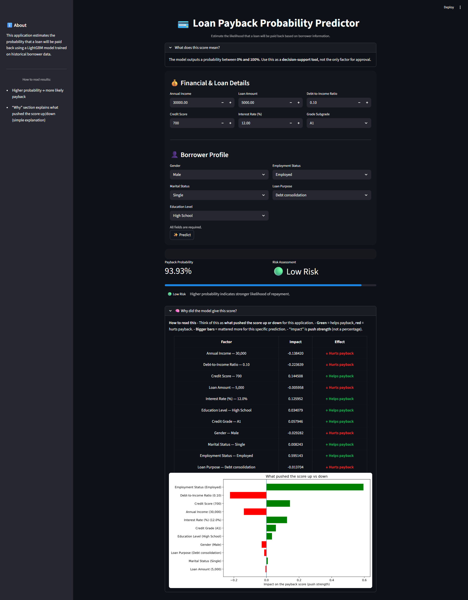

# Loan Payback Prediction

Predicting the probability a borrower will pay back their loan.  
Kaggle Playground Series Season 5, Episode 11



## Overview
Conducted exploratory data analysis (EDA) to understand feature distributions, correlations, 
and class balance. Preprocessing included label encoding of categorical 
features.

Trained and compared 4 machine learning models (Logistic Regression, ANN, XGBoost, LightGBM) 
using 5-fold cross validation with ROC-AUC as the evaluation metric. Hyperparameter tuning was 
performed using Optuna for XGBoost, ANN, and LightGBM. 

LightGBM with Optuna tuning achieved the best mean CV AUC of 0.9227 and was selected as the 
final model based on both performance and training efficiency. The final model was deployed as 
an interactive web application with SHAP-based explainability showing feature-level impact 
on each individual prediction.

## Results


| Model | Mean CV AUC | Kaggle Public Score | Kaggle Private Score |
|---|---|---|---|
| Logistic Regression | 0.9101 | 0.91067 | 0.91133 |
| ANN Baseline | 0.9122 | 0.91284 | 0.91324 |
| ANN (Optuna Tuned) | 0.9122 | 0.91278 | 0.91300 |
| XGBoost Baseline | 0.9208 | 0.92063 | 0.92178 |
| XGBoost (Optuna Tuned) | 0.9218 | 0.92146 | 0.92277 |
| LightGBM Baseline | 0.9214 | 0.92157 | 0.92268 |
| **LightGBM (Optuna Tuned)** | **0.9227 ✅ Best** | **0.92276** | **0.92389** |


## Tech Stack
- **Language:** Python
- **ML Models:** LightGBM, XGBoost, TensorFlow/Keras (ANN), Scikit-learn (Logistic Regression)
- **Hyperparameter Tuning:** Optuna
- **Data Processing:** Pandas, NumPy, Matplotlib, Seaborn
- **Explainability:** SHAP
- **Backend:** FastAPI
- **Frontend:** Streamlit

## How to Run

Install dependencies:
```bash
pip install -r requirements.txt
```

Run the FastAPI backend:
```bash
cd Backend
uvicorn api_app:app --reload
```

Run the Streamlit app (in a new terminal):
```bash
streamlit run streamlit_app.py
```

## Dataset
Download from [Kaggle](https://kaggle.com/competitions/playground-series-s5e11)
and place in the Dataset/ folder.
